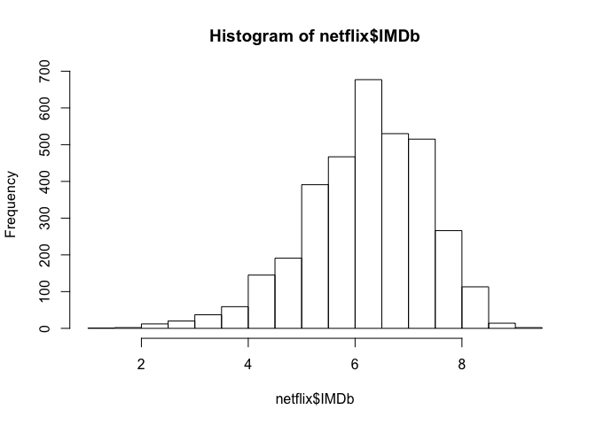
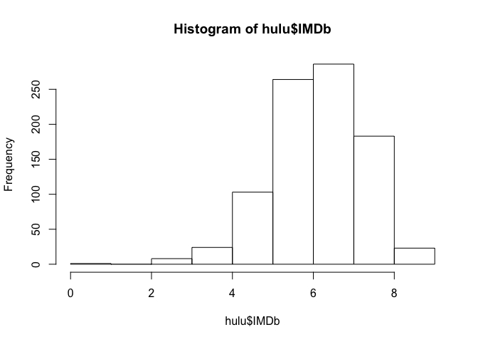
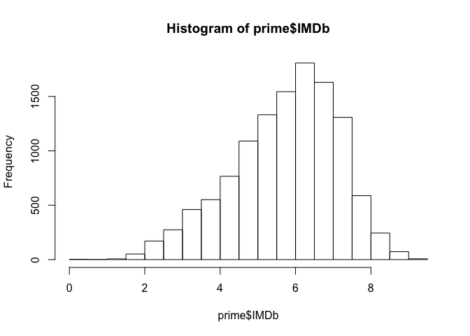
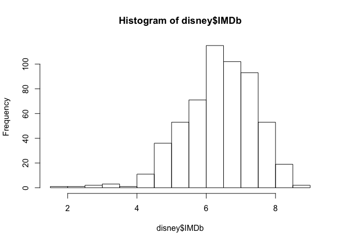
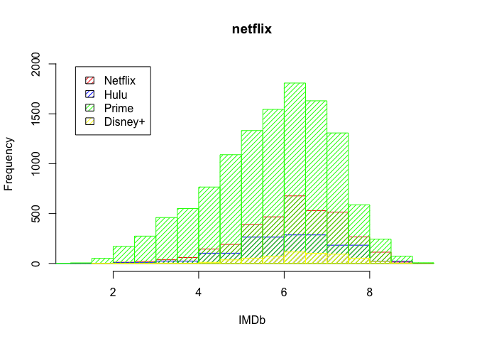
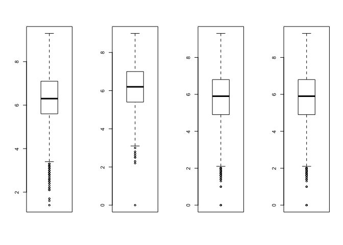
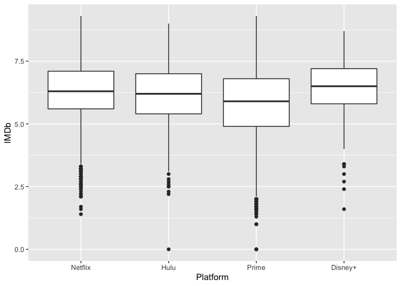
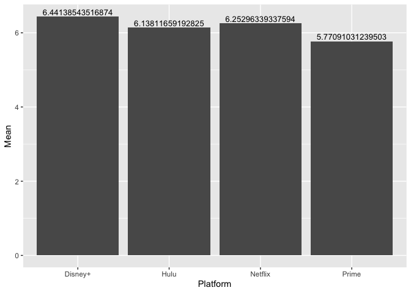

Untitled
================

``` r
getwd()
```

    ## [1] "/Users/Luna/Desktop/Movie/the-avocados-movies/Nora"

``` r
table <- read.csv("/Users/Luna/Desktop/Movie/the-avocados-movies/resources/MoviesOnStreamingPlatforms_updated.csv")
head(table)
```

    ##   X ID                             Title Year Age IMDb Rotten.Tomatoes Netflix
    ## 1 0  1                         Inception 2010 13+  8.8             87%       1
    ## 2 1  2                        The Matrix 1999 18+  8.7             87%       1
    ## 3 2  3            Avengers: Infinity War 2018 13+  8.5             84%       1
    ## 4 3  4                Back to the Future 1985  7+  8.5             96%       1
    ## 5 4  5    The Good, the Bad and the Ugly 1966 18+  8.8             97%       1
    ## 6 5  6 Spider-Man: Into the Spider-Verse 2018  7+  8.4             97%       1
    ##   Hulu Prime.Video Disney. Type                                   Directors
    ## 1    0           0       0    0                           Christopher Nolan
    ## 2    0           0       0    0              Lana Wachowski,Lilly Wachowski
    ## 3    0           0       0    0                     Anthony Russo,Joe Russo
    ## 4    0           0       0    0                             Robert Zemeckis
    ## 5    0           1       0    0                                Sergio Leone
    ## 6    0           0       0    0 Bob Persichetti,Peter Ramsey,Rodney Rothman
    ##                                     Genres                      Country
    ## 1         Action,Adventure,Sci-Fi,Thriller United States,United Kingdom
    ## 2                            Action,Sci-Fi                United States
    ## 3                  Action,Adventure,Sci-Fi                United States
    ## 4                  Adventure,Comedy,Sci-Fi                United States
    ## 5                                  Western     Italy,Spain,West Germany
    ## 6 Animation,Action,Adventure,Family,Sci-Fi                United States
    ##                  Language Runtime
    ## 1 English,Japanese,French     148
    ## 2                 English     136
    ## 3                 English     149
    ## 4                 English     116
    ## 5                 Italian     161
    ## 6         English,Spanish     117

``` r
netflix <- table[table$Netflix == 1,]
hist(netflix$IMDb)
```

<!-- -->

``` r
mean(netflix$IMDb, na.rm = TRUE)
```

    ## [1] 6.252963

``` r
mode(netflix$IMDb)
```

    ## [1] "numeric"

``` r
hulu <- table[table$Hulu == 1,]
hist(hulu$IMDb)
```

<!-- -->

``` r
mean(hulu$IMDb, na.rm = TRUE)
```

    ## [1] 6.138117

``` r
mode(hulu$IMDb)
```

    ## [1] "numeric"

``` r
prime <- table[table$Prime.Video == 1,]
hist(prime$IMDb)
```

<!-- -->

``` r
mean(prime$IMDb, na.rm = TRUE)
```

    ## [1] 5.77091

``` r
mode(prime$IMDb)
```

    ## [1] "numeric"

``` r
disney <- table[table$Disney. == 1,]
hist(disney$IMDb)
```

<!-- -->

``` r
mean(disney$IMDb, na.rm = TRUE)
```

    ## [1] 6.441385

``` r
mode(disney$IMDb)
```

    ## [1] "numeric"

``` r
#par(mfrow = c(1, 4))
hist(netflix$IMDb, main = 'netflix', xlab = 'IMDb',
     prob = FALSE, density = 20, col = "red",
     ylim = c(0, 2000))
hist(hulu$IMDb, main = 'hulu', add = TRUE,
     prob = FALSE, density = 20, col = "blue",)
hist(prime$IMDb, main = 'prime', add = TRUE,
     prob = FALSE, density = 20, col = "green",)
hist(disney$IMDb, main = 'disney', add = TRUE,
     prob = FALSE, density = 20, col = "yellow",)

legend("topleft", c("Netflix", "Hulu", 'Prime', 'Disney+'), density = c(20, 20, 20, 20),
fill = c("red", "blue", "green", "yellow"), inset = 0.05)
```

<!-- -->

``` r
par(mfrow = c(1, 4))
boxplot(netflix$IMDb)
boxplot(hulu$IMDb)
boxplot(prime$IMDb)
boxplot(prime$IMDb)
```

<!-- -->

``` r
mode(netflix$IMDb)
```

    ## [1] "numeric"

``` r
library(ggplot2)
```

``` r
imbd <- data.frame("Platform" = c(), "IMDb" = c())
df_netflix <- data.frame("Platform" = "Netflix", "IMDb" = netflix$IMDb)
df_hulu <- data.frame("Platform" = "Hulu", "IMDb" = hulu$IMDb)
df_prime <- data.frame("Platform" = "Prime", "IMDb" = prime$IMDb)
df_disney <- data.frame("Platform" = "Disney+", "IMDb" = disney$IMDb)
imdb <- rbind(df_netflix, df_hulu, df_prime, df_disney)
```

``` r
p <- ggplot(imdb, aes(x=Platform, y=IMDb)) + 
  geom_boxplot()
p
```

    ## Warning: Removed 576 rows containing non-finite values (stat_boxplot).

<!-- -->

``` r
df_mean <- data.frame("Platform" = c("Netflix", "Hulu", "Prime", "Disney+"), "Mean" = c(mean(netflix$IMDb, na.rm = TRUE), mean(hulu$IMDb, na.rm = TRUE), mean(prime$IMDb, na.rm = TRUE), mean(disney$IMDb, na.rm = TRUE)))

p<-ggplot(data=df_mean, aes(x=Platform, y=Mean)) +
  geom_bar(stat="identity") + geom_text(aes(label=Mean), vjust=-0.3, size=3.5)
p
```

<!-- -->
