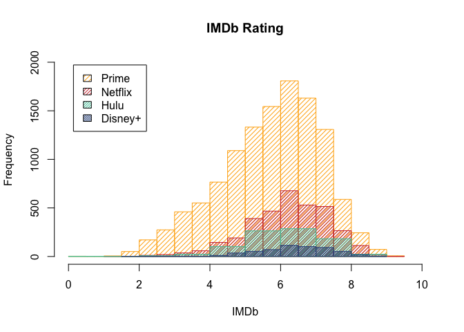
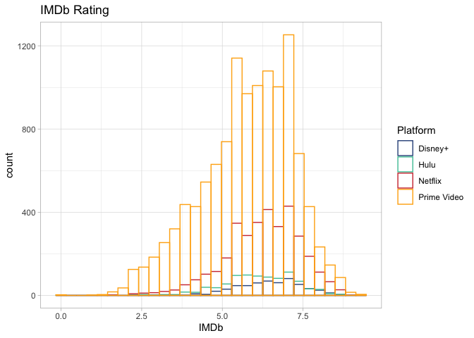

```r
getwd()
```

```
## [1] "/Users/Luna/Desktop/Movie/the-avocados-movies/Nora"
```


## Import Data


```r
table <- read.csv("/Users/Luna/Desktop/Movie/the-avocados-movies/resources/MoviesOnStreamingPlatforms_updated.csv")

# convert rotten tomato column into numerical data
rotten_ch <- as.character(table$Rotten.Tomatoes)

rotten_ch <- strsplit(rotten_ch, split = "%")

rotten_temp <- numeric(0)

for (i in 1:16744) {
  if (length(rotten_ch[i]) == 0){
    rotten_temp <- c(rotten_temp, NA)
  } else {
    rotten_temp <- c(rotten_temp, rotten_ch[i])
  }
}

rotten_ch <- rotten_temp

rotten_ch <- as.numeric(rotten_ch) / 100


table$Rotten.Tomatoes <- rotten_ch
knitr::kable(head(table))
```


  X   ID  Title                                Year  Age    IMDb   Rotten.Tomatoes   Netflix   Hulu   Prime.Video   Disney.   Type  Directors                                     Genres                                     Country                        Language                   Runtime
---  ---  ----------------------------------  -----  ----  -----  ----------------  --------  -----  ------------  --------  -----  --------------------------------------------  -----------------------------------------  -----------------------------  ------------------------  --------
  0    1  Inception                            2010  13+     8.8              0.87         1      0             0         0      0  Christopher Nolan                             Action,Adventure,Sci-Fi,Thriller           United States,United Kingdom   English,Japanese,French        148
  1    2  The Matrix                           1999  18+     8.7              0.87         1      0             0         0      0  Lana Wachowski,Lilly Wachowski                Action,Sci-Fi                              United States                  English                        136
  2    3  Avengers: Infinity War               2018  13+     8.5              0.84         1      0             0         0      0  Anthony Russo,Joe Russo                       Action,Adventure,Sci-Fi                    United States                  English                        149
  3    4  Back to the Future                   1985  7+      8.5              0.96         1      0             0         0      0  Robert Zemeckis                               Adventure,Comedy,Sci-Fi                    United States                  English                        116
  4    5  The Good, the Bad and the Ugly       1966  18+     8.8              0.97         1      0             1         0      0  Sergio Leone                                  Western                                    Italy,Spain,West Germany       Italian                        161
  5    6  Spider-Man: Into the Spider-Verse    2018  7+      8.4              0.97         1      0             0         0      0  Bob Persichetti,Peter Ramsey,Rodney Rothman   Animation,Action,Adventure,Family,Sci-Fi   United States                  English,Spanish                117

## Histogram of IMDb Rating and Rotten Tomatoes

```r
netflix <- table[table$Netflix == 1,]
mean(netflix$IMDb, na.rm = TRUE)
```

```
## [1] 6.252963
```

```r
# hulu
hulu <- table[table$Hulu == 1,]
mean(hulu$IMDb, na.rm = TRUE)
```

```
## [1] 6.138117
```

```r
# prime
prime <- table[table$Prime.Video == 1,]
mean(prime$IMDb, na.rm = TRUE)
```

```
## [1] 5.77091
```

```r
# disney
disney <- table[table$Disney. == 1,]

mean(disney$IMDb, na.rm = TRUE)
```

```
## [1] 6.441385
```

```r
par(mfrow = c(2, 2))
hist(netflix$IMDb)
abline(v = mean(netflix$IMDb, na.rm = TRUE), lty = 2, col = "red")
legend("topleft", c("Mean"), col = c("red"),
lty = c(2), inset = 0.05 )

hist(hulu$IMDb)
abline(v = mean(hulu$IMDb, na.rm = TRUE), lty = 2, col = "red")
legend("topleft", c("Mean"), col = c("red"),
lty = c(2), inset = 0.05 )

hist(prime$IMDb)
abline(v = mean(prime$IMDb, na.rm = TRUE), lty = 2, col = "red")
legend("topleft", c("Mean"), col = c("red"),
lty = c(2), inset = 0.05 )

hist(disney$IMDb)
abline(v = mean(disney$IMDb, na.rm = TRUE), lty = 2, col = "red")
legend("topleft", c("Mean"), col = c("red"),
lty = c(2), inset = 0.05 )
```

<!-- -->


```r
hist(netflix$IMDb, main = 'IMDb Rating', xlab = 'IMDb',
     prob = FALSE, density = 20, col = "red",
     ylim = c(0, 2000), xlim=c(0, 10))
hist(hulu$IMDb, main = 'hulu', add = TRUE,
     prob = FALSE, density = 20, col = "blue",)
hist(prime$IMDb, main = 'prime', add = TRUE,
     prob = FALSE, density = 20, col = "#9FE2BF",)
hist(disney$IMDb, main = 'disney', add = TRUE,
     prob = FALSE, density = 20, col = "yellow",)

legend("topleft", c("Netflix", "Hulu", 'Prime', 'Disney+'), density = c(20, 20, 20, 20),
fill = c("red", "blue", "#9FE2BF", "yellow"), inset = 0.05)
```

<!-- -->


```r
hist(netflix$Rotten.Tomatoes, main = 'Rotten Tomatoes', xlab = 'Rotten Tomatoes',
     prob = FALSE, density = 20, col = "red",
     ylim = c(0, 800))
hist(hulu$Rotten.Tomatoes, main = 'hulu', add = TRUE,
     prob = FALSE, density = 20, col = "blue",)
hist(prime$Rotten.Tomatoes, main = 'prime', add = TRUE,
     prob = FALSE, density = 20, col = "#9FE2BF",)
hist(disney$Rotten.Tomatoes, main = 'disney', add = TRUE,
     prob = FALSE, density = 20, col = "yellow",)

legend("topleft", c("Netflix", "Hulu", 'Prime', 'Disney+'), density = c(20, 20, 20, 20),
fill = c("red", "blue", "#9FE2BF", "yellow"), inset = 0.05)
```

<!-- -->


## T-test on mean


```r
mean_imdb <- data.frame("Netflix" = mean(netflix$IMDb, na.rm = TRUE),
                        "Hulu" = mean(hulu$IMDb, na.rm = TRUE),
                        "Prime" = mean(prime$IMDb, na.rm = TRUE),
                        "Disney+" = mean(disney$IMDb, na.rm = TRUE))
mean_imdb
```

```
##    Netflix     Hulu   Prime  Disney.
## 1 6.252963 6.138117 5.77091 6.441385
```


```r
netflix_hulu <- t.test(netflix$IMDb, hulu$IMDb, alternative = "two.sided", var.equal = FALSE)
netflix_prime <- t.test(netflix$IMDb, prime$IMDb, alternative = "two.sided", var.equal = FALSE)
netflix_disney <- t.test(netflix$IMDb, disney$IMDb, alternative = "two.sided", var.equal = FALSE)

hulu_prime <- t.test(hulu$IMDb, prime$IMDb, alternative = "two.sided", var.equal = FALSE)
hulu_disney <- t.test(hulu$IMDb, disney$IMDb, alternative = "two.sided", var.equal = FALSE)

prime_disney <- t.test(prime$IMDb, disney$IMDb, alternative = "two.sided", var.equal = FALSE)

t_test <- data.frame("Netflix" = c(NA, netflix_hulu$p.value, netflix_prime$p.value, netflix_disney$p.value), "Hulu" = c(NA, NA, hulu_prime$p.value, hulu_disney$p.value), "Prime" = c(NA, NA, NA, prime_disney$p.value), "Disney+" = c(NA, NA, NA, NA))
rownames(t_test) <- c("Netflix", "Hulu", "Prime", "Disney+")
t_test
```

```
##              Netflix         Hulu        Prime Disney.
## Netflix           NA           NA           NA      NA
## Hulu    6.733731e-03           NA           NA      NA
## Prime   1.499854e-92 1.180677e-19           NA      NA
## Disney+ 8.402601e-05 1.585763e-07 6.477789e-43      NA
```


## Boxplots of IMDb Rating


```r
library(ggplot2)
```


```r
# create imdb dataset
imbd <- data.frame("Platform" = c(), "IMDb" = c())
df_netflix <- data.frame("Platform" = "Netflix", "IMDb" = netflix$IMDb)
df_hulu <- data.frame("Platform" = "Hulu", "IMDb" = hulu$IMDb)
df_prime <- data.frame("Platform" = "Prime", "IMDb" = prime$IMDb)
df_disney <- data.frame("Platform" = "Disney+", "IMDb" = disney$IMDb)
imdb <- rbind(df_netflix, df_hulu, df_prime, df_disney)
```


```r
p1 <- ggplot(imdb, aes(x=Platform, y=IMDb)) + 
  geom_boxplot()
p1 <- p1 + ggtitle("IMDB of movies on four platforms")
```


```r
# action movies
action_movies <- data.frame()
for (i in 1:16744){
  movie_to_test <- table[i,]
  genre <- as.character(movie_to_test$Genres)
  genre <- unlist(strsplit(genre, split = ","))
  if (any("Action" == genre)){
    action_movies <- rbind(action_movies, movie_to_test)
  }
}


action_netflix <- table[action_movies$Netflix == 1,]
action_hulu <- table[action_movies$Hulu == 1,]
action_prime <- table[action_movies$Prime.Video == 1,]
action_disney <- table[action_movies$Disney. == 1,]

df_action_imdb <- data.frame("Platform" = c(), "IMDb" = c())
df_action_netflix <- data.frame("Platform" = "Netflix", "IMDb" = action_netflix$IMDb)
df_action_hulu <- data.frame("Platform" = "Hulu", "IMDb" = action_hulu$IMDb)
df_action_prime <- data.frame("Platform" = "Prime", "IMDb" = action_prime$IMDb)
df_action_disney <- data.frame("Platform" = "Disney+", "IMDb" = action_disney$IMDb)
df_action_imdb <- rbind(df_action_netflix, df_action_hulu, df_action_prime, df_action_disney)

p2 <- ggplot(df_action_imdb, aes(x=Platform, y=IMDb)) + 
  geom_boxplot()
p2 <- p2 + ggtitle("IMDB of Action Movies")
```


```r
# Sci-Fi movies
scifi_movies <- data.frame()
for (i in 1:16744){
  movie_to_test <- table[i,]
  genre <- as.character(movie_to_test$Genres)
  genre <- unlist(strsplit(genre, split = ","))
  if (any("Sci-Fi" == genre)){
    scifi_movies <- rbind(scifi_movies, movie_to_test)
  }
}


scifi_netflix <- table[scifi_movies$Netflix == 1,]
scifi_hulu <- table[scifi_movies$Hulu == 1,]
scifi_prime <- table[scifi_movies$Prime.Video == 1,]
scifi_disney <- table[scifi_movies$Disney. == 1,]

df_scifi_imdb <- data.frame("Platform" = c(), "IMDb" = c())
df_scifi_netflix <- data.frame("Platform" = "Netflix", "IMDb" = scifi_netflix$IMDb)
df_scifi_hulu <- data.frame("Platform" = "Hulu", "IMDb" = scifi_hulu$IMDb)
df_scifi_prime <- data.frame("Platform" = "Prime", "IMDb" = scifi_prime$IMDb)
df_scifi_disney <- data.frame("Platform" = "Disney+", "IMDb" = scifi_disney$IMDb)
df_scifi_imdb <- rbind(df_scifi_netflix, df_scifi_hulu, df_scifi_prime, df_scifi_disney)

p3 <- ggplot(df_scifi_imdb, aes(x=Platform, y=IMDb)) + 
  geom_boxplot()
p3 <- p3 + ggtitle("IMDB of Sci-Fi Movies")
```


```r
# Comedy movies
comedy_movies <- data.frame()
for (i in 1:16744){
  movie_to_test <- table[i,]
  genre <- as.character(movie_to_test$Genres)
  genre <- unlist(strsplit(genre, split = ","))
  if (any("Comedy" == genre)){
    comedy_movies <- rbind(scifi_movies, movie_to_test)
  }
}


comedy_netflix <- table[comedy_movies$Netflix == 1,]
comedy_hulu <- table[comedy_movies$Hulu == 1,]
comedy_prime <- table[comedy_movies$Prime.Video == 1,]
comedy_disney <- table[comedy_movies$Disney. == 1,]

df_comedy_imdb <- data.frame("Platform" = c(), "IMDb" = c())
df_comedy_netflix <- data.frame("Platform" = "Netflix", "IMDb" = comedy_netflix$IMDb)
df_comedy_hulu <- data.frame("Platform" = "Hulu", "IMDb" = comedy_hulu$IMDb)
df_comedy_prime <- data.frame("Platform" = "Prime", "IMDb" = comedy_prime$IMDb)
df_comedy_disney <- data.frame("Platform" = "Disney+", "IMDb" = comedy_disney$IMDb)
df_comedy_imdb <- rbind(df_comedy_netflix, df_comedy_hulu, df_comedy_prime, df_comedy_disney)

p4 <- ggplot(df_comedy_imdb, aes(x=Platform, y=IMDb)) + 
  geom_boxplot()
p4 <- p4 + ggtitle("IMDB of Comedy Movies")
```


```r
library(gridExtra)
grid.arrange(p1, p2, p3, p4, nrow = 2, ncol = 2)
```

```
## Warning: Removed 576 rows containing non-finite values (stat_boxplot).
```

```
## Warning: Removed 586 rows containing non-finite values (stat_boxplot).
```

```
## Warning: Removed 608 rows containing non-finite values (stat_boxplot).
```

```
## Warning: Removed 603 rows containing non-finite values (stat_boxplot).
```

<!-- -->

## Boxplots of Rotten Tomatoes


```r
rotten <- data.frame("Platform" = c(), "Rotten" = c())
df_netflix_rotten <- data.frame("Platform" = "Netflix", "Rotten" = netflix$Rotten.Tomatoes)
df_hulu_rotten <- data.frame("Platform" = "Hulu", "Rotten" = hulu$Rotten.Tomatoes)
df_prime_rotten <- data.frame("Platform" = "Prime", "Rotten" = prime$Rotten.Tomatoes)
df_disney_rotten <- data.frame("Platform" = "Disney+", "Rotten" = disney$Rotten.Tomatoes)
rotten <- rbind(df_netflix_rotten, df_hulu_rotten, df_prime_rotten, df_disney_rotten)

r1 <- ggplot(rotten, aes(x=Platform, y=Rotten)) + 
  geom_boxplot()
r1 <- r1 + ggtitle("Rotten Tomatoes on the four platforms")
```


```r
# action movies

df_action_rotten <- data.frame("Platform" = c(), "Rotten" = c())

df_action_netflix_rotten <- data.frame("Platform" = "Netflix", "Rotten" = action_netflix$Rotten.Tomatoes)
df_action_hulu_rotten <- data.frame("Platform" = "Hulu", "Rotten" = action_hulu$Rotten.Tomatoes)
df_action_prime_rotten <- data.frame("Platform" = "Prime", "Rotten" = action_prime$Rotten.Tomatoes)
df_action_disney_rotten <- data.frame("Platform" = "Disney+", "Rotten" = action_disney$Rotten.Tomatoes)

df_action_rotten <- rbind(df_action_netflix_rotten,
                          df_action_hulu_rotten,
                          df_action_prime_rotten,
                          df_action_disney_rotten)

r2 <- ggplot(df_action_rotten, aes(x=Platform, y=Rotten)) + 
  geom_boxplot()
r2 <- r2 + ggtitle("Rotten Tomatoes of Action Movies")
```


```r
# sci-fi movies

df_scifi_rotten <- data.frame("Platform" = c(), "Rotten" = c())

df_scifi_netflix_rotten <- data.frame("Platform" = "Netflix", "Rotten" = scifi_netflix$Rotten.Tomatoes)
df_scifi_hulu_rotten <- data.frame("Platform" = "Hulu", "Rotten" = scifi_hulu$Rotten.Tomatoes)
df_scifi_prime_rotten <- data.frame("Platform" = "Prime", "Rotten" = scifi_prime$Rotten.Tomatoes)
df_scifi_disney_rotten <- data.frame("Platform" = "Disney+", "Rotten" = scifi_disney$Rotten.Tomatoes)

df_scifi_rotten <- rbind(df_scifi_netflix_rotten,
                          df_scifi_hulu_rotten,
                          df_scifi_prime_rotten,
                          df_scifi_disney_rotten)

r3 <- ggplot(df_scifi_rotten, aes(x=Platform, y=Rotten)) + 
  geom_boxplot()
r3 <- r3 + ggtitle("Rotten Tomatoes of Sci-Fi Movies")
```


```r
# comedy movies

df_comedy_rotten <- data.frame("Platform" = c(), "Rotten" = c())

df_comedy_netflix_rotten <- data.frame("Platform" = "Netflix", "Rotten" = comedy_netflix$Rotten.Tomatoes)
df_comedy_hulu_rotten <- data.frame("Platform" = "Hulu", "Rotten" = comedy_hulu$Rotten.Tomatoes)
df_comedy_prime_rotten <- data.frame("Platform" = "Prime", "Rotten" = comedy_prime$Rotten.Tomatoes)
df_comedy_disney_rotten <- data.frame("Platform" = "Disney+", "Rotten" = comedy_disney$Rotten.Tomatoes)

df_comedy_rotten <- rbind(df_comedy_netflix_rotten,
                          df_comedy_hulu_rotten,
                          df_comedy_prime_rotten,
                          df_comedy_disney_rotten)

r4 <- ggplot(df_comedy_rotten, aes(x=Platform, y=Rotten)) + 
  geom_boxplot()
r4 <- r4 + ggtitle("Rotten Tomatoes of Comedy Movies")
```


```r
grid.arrange(r1, r2, r3, r4, nrow = 2, ncol = 2)
```

```
## Warning: Removed 11895 rows containing non-finite values (stat_boxplot).
```

```
## Warning: Removed 12150 rows containing non-finite values (stat_boxplot).
```

```
## Warning: Removed 12011 rows containing non-finite values (stat_boxplot).
```

```
## Warning: Removed 12014 rows containing non-finite values (stat_boxplot).
```

<!-- -->

## Data on Movies above 8.0


```r
movie_above_eight <- table[(table$IMDb >= 8.0) & !is.na(table$IMDb), ]
netflix_eight <- movie_above_eight[movie_above_eight$Netflix == 1,]
hulu_eight <- movie_above_eight[movie_above_eight$Hulu == 1,]
prime_eight <- movie_above_eight[movie_above_eight$Prime.Video == 1,]
disney_eight <- movie_above_eight[movie_above_eight$Disney. == 1,]
nrow(netflix_eight)
```

```
## [1] 166
```

```r
nrow(hulu_eight)
```

```
## [1] 34
```

```r
nrow(prime_eight)
```

```
## [1] 397
```

```r
nrow(disney_eight)
```

```
## [1] 36
```

```r
nrow(movie_above_eight)
```

```
## [1] 607
```

```r
knitr::kable(head(movie_above_eight))
```


  X   ID  Title                                Year  Age    IMDb   Rotten.Tomatoes   Netflix   Hulu   Prime.Video   Disney.   Type  Directors                                     Genres                                     Country                        Language                   Runtime
---  ---  ----------------------------------  -----  ----  -----  ----------------  --------  -----  ------------  --------  -----  --------------------------------------------  -----------------------------------------  -----------------------------  ------------------------  --------
  0    1  Inception                            2010  13+     8.8              0.87         1      0             0         0      0  Christopher Nolan                             Action,Adventure,Sci-Fi,Thriller           United States,United Kingdom   English,Japanese,French        148
  1    2  The Matrix                           1999  18+     8.7              0.87         1      0             0         0      0  Lana Wachowski,Lilly Wachowski                Action,Sci-Fi                              United States                  English                        136
  2    3  Avengers: Infinity War               2018  13+     8.5              0.84         1      0             0         0      0  Anthony Russo,Joe Russo                       Action,Adventure,Sci-Fi                    United States                  English                        149
  3    4  Back to the Future                   1985  7+      8.5              0.96         1      0             0         0      0  Robert Zemeckis                               Adventure,Comedy,Sci-Fi                    United States                  English                        116
  4    5  The Good, the Bad and the Ugly       1966  18+     8.8              0.97         1      0             1         0      0  Sergio Leone                                  Western                                    Italy,Spain,West Germany       Italian                        161
  5    6  Spider-Man: Into the Spider-Verse    2018  7+      8.4              0.97         1      0             0         0      0  Bob Persichetti,Peter Ramsey,Rodney Rothman   Animation,Action,Adventure,Family,Sci-Fi   United States                  English,Spanish                117

## Data on movies with imdb between 6 and 8


```r
movie_six_to_eight <- table[(table$IMDb >= 6.0) & (table$IMDb < 8.0) & !is.na(table$IMDb), ]
netflix_six_to_eight <- movie_six_to_eight[movie_six_to_eight$Netflix == 1,]
hulu_six_to_eight <- movie_six_to_eight[movie_six_to_eight$Hulu == 1,]
prime_six_to_eight <- movie_six_to_eight[movie_six_to_eight$Prime.Video == 1,]
disney_six_to_eight <- movie_six_to_eight[movie_six_to_eight$Disney. == 1,]

knitr::kable(head(movie_six_to_eight))
```

       X   ID  Title                      Year  Age    IMDb   Rotten.Tomatoes   Netflix   Hulu   Prime.Video   Disney.   Type  Directors          Genres                          Country                                         Language                                              Runtime
---  ---  ---  ------------------------  -----  ----  -----  ----------------  --------  -----  ------------  --------  -----  -----------------  ------------------------------  ----------------------------------------------  ---------------------------------------------------  --------
22    21   22  The Social Network         2010  13+     7.7              0.96         1      0             0         0      0  David Fincher      Biography,Drama                 United States                                   English,French                                            120
26    25   26  Ex Machina                 2015  18+     7.7              0.92         1      0             0         0      0  Alex Garland       Drama,Mystery,Sci-Fi,Thriller   United Kingdom,United States                    English                                                   108
27    26   27  Silver Linings Playbook    2012  18+     7.7              0.92         1      0             0         0      0  David O. Russell   Comedy,Drama,Romance            United States                                   English                                                   122
28    27   28  District 9                 2009  18+     7.9              0.90         1      0             0         0      0  Neill Blomkamp     Action,Sci-Fi,Thriller          South Africa,United States,New Zealand,Canada   English,Nyanja,Afrikaans,Zulu,Xhosa,Southern Sotho        112
29    28   29  The Irishman               2019  18+     7.9              0.96         1      0             0         0      0  Martin Scorsese    Biography,Crime,Drama           United States                                   English,Italian,Latin,Spanish,German                      209
30    29   30  Moon                       2009  18+     7.9              0.90         1      0             0         0      0  Duncan Jones       Drama,Mystery,Sci-Fi            United Kingdom,United States                    English,Spanish                                            97


```r
venn <- data.frame("Netflix" = c(),
                   "Hulu" = c(),
                   "Prime" = c(),
                   "Disney+" = c(),
                   "Count" = c())

venn <- rbind(venn, c(0,0,0,0,0),
              c(1,0,0,0,0), c(0,1,0,0,0), c(0,0,1,0,0), c(0,0,0,1,0),
              c(1,1,0,0,0), c(1,0,1,0,0), c(1,0,0,1,0), c(0,1,1,0,0), c(0,1,0,1,0), c(0,0,1,1,0),
              c(1,1,1,0,0), c(1,1,0,1,0), c(1,0,1,1,0), c(0,1,1,1,0),
              c(1,1,1,1,0))
colnames(venn) <- c("Netflix", "Hulu", "Prime", "Disney+", "Count")
venn[1,5] <- nrow(movie_above_eight[(movie_above_eight$Netflix == 0)
                  & (movie_above_eight$Hulu == 0)
                  & (movie_above_eight$Prime.Video == 0)
                  & (movie_above_eight$Disney. == 0),])
venn[2,5] <- nrow(movie_above_eight[(movie_above_eight$Netflix == 1)
                  & (movie_above_eight$Hulu == 0)
                  & (movie_above_eight$Prime.Video == 0)
                  & (movie_above_eight$Disney. == 0),])
venn[3,5] <- nrow(movie_above_eight[(movie_above_eight$Netflix == 0)
                  & (movie_above_eight$Hulu == 1)
                  & (movie_above_eight$Prime.Video == 0)
                  & (movie_above_eight$Disney. == 0),])
venn[4,5] <- nrow(movie_above_eight[(movie_above_eight$Netflix == 0)
                  & (movie_above_eight$Hulu == 0)
                  & (movie_above_eight$Prime.Video == 1)
                  & (movie_above_eight$Disney. == 0),])
venn[5,5] <- nrow(movie_above_eight[(movie_above_eight$Netflix == 0)
                  & (movie_above_eight$Hulu == 0)
                  & (movie_above_eight$Prime.Video == 0)
                  & (movie_above_eight$Disney. == 1),])
venn[6,5] <- nrow(movie_above_eight[(movie_above_eight$Netflix == 1)
                  & (movie_above_eight$Hulu == 1)
                  & (movie_above_eight$Prime.Video == 0)
                  & (movie_above_eight$Disney. == 0),])
venn[7,5] <- nrow(movie_above_eight[(movie_above_eight$Netflix == 1)
                  & (movie_above_eight$Hulu == 0)
                  & (movie_above_eight$Prime.Video == 1)
                  & (movie_above_eight$Disney. == 0),])
venn[8,5] <- nrow(movie_above_eight[(movie_above_eight$Netflix == 1)
                  & (movie_above_eight$Hulu == 0)
                  & (movie_above_eight$Prime.Video == 0)
                  & (movie_above_eight$Disney. == 1),])
venn[9,5] <- nrow(movie_above_eight[(movie_above_eight$Netflix == 0)
                  & (movie_above_eight$Hulu == 1)
                  & (movie_above_eight$Prime.Video == 1)
                  & (movie_above_eight$Disney. == 0),])
venn[10,5] <- nrow(movie_above_eight[(movie_above_eight$Netflix == 0)
                  & (movie_above_eight$Hulu == 1)
                  & (movie_above_eight$Prime.Video == 0)
                  & (movie_above_eight$Disney. == 1),])
venn[11,5] <- nrow(movie_above_eight[(movie_above_eight$Netflix == 0)
                  & (movie_above_eight$Hulu == 0)
                  & (movie_above_eight$Prime.Video == 1)
                  & (movie_above_eight$Disney. == 1),])
venn[12,5] <- nrow(movie_above_eight[(movie_above_eight$Netflix == 1)
                  & (movie_above_eight$Hulu == 1)
                  & (movie_above_eight$Prime.Video == 1)
                  & (movie_above_eight$Disney. == 0),])
venn[13,5] <- nrow(movie_above_eight[(movie_above_eight$Netflix == 1)
                  & (movie_above_eight$Hulu == 1)
                  & (movie_above_eight$Prime.Video == 0)
                  & (movie_above_eight$Disney. == 1),])
venn[14,5] <- nrow(movie_above_eight[(movie_above_eight$Netflix == 1)
                  & (movie_above_eight$Hulu == 0)
                  & (movie_above_eight$Prime.Video == 1)
                  & (movie_above_eight$Disney. == 1),])
venn[15,5] <- nrow(movie_above_eight[(movie_above_eight$Netflix == 0)
                  & (movie_above_eight$Hulu == 1)
                  & (movie_above_eight$Prime.Video == 1)
                  & (movie_above_eight$Disney. == 1),])
venn[16,5] <- nrow(movie_above_eight[(movie_above_eight$Netflix == 1)
                  & (movie_above_eight$Hulu == 1)
                  & (movie_above_eight$Prime.Video == 1)
                  & (movie_above_eight$Disney. == 1),])
venn <- venn[2:16,]
#venn
platforms <- c("Netflix", "Hulu", "Prime", "Disney+", "Netflix + Hulu", "Netflix + Prime", "Netflix + Disney+", "Hulu + Prime", "Hulu + Disney+", "Prime + Disney+", "Netflix + Hulu + Prime","Netflix + Hulu + Disney+", "Netflix + Prime + Disney+", "Hulu + Prime + Disney+", "All")
venn <- cbind(platforms, venn)
venn <- venn[1:14,]
```

## Pie Chart to show percent of good movies

```r
bp<- ggplot(venn[, c(1,6)], aes(x="", y=Count, fill=platforms))+
geom_bar(width = 1, stat = "identity")
pie <- bp + coord_polar("y", start=0)
pie <- pie + ggtitle("Number of movies with IMDb above 8.0 on various platforms")
pie
```

<!-- -->

## Bar Plots on count and percentage


```r
df_total <- data.frame("Platform" = c("Netflix", "Netflix", "Netflix", "Hulu", "Hulu", "Hulu", "Prime", "Prime", "Prime", "Disney+", "Disney+", "Disney+"),
                       "IMDb" = rep(c("Above 8.0", "6.0-8.0", "Below 6.0"), 4),
                       "Count" = c(nrow(netflix_eight), nrow(netflix_six_to_eight), nrow(netflix)-nrow(netflix_eight)-nrow(netflix_six_to_eight),
                                  nrow(hulu_eight), nrow(hulu_six_to_eight), nrow(hulu) - nrow(hulu_eight)-nrow(hulu_six_to_eight),
                                  nrow(prime_eight), nrow(prime_six_to_eight) ,nrow(prime)-nrow(prime_eight)-nrow(prime_six_to_eight),
                                  nrow(disney_eight), nrow(disney_six_to_eight) ,nrow(disney) - nrow(disney_eight)-nrow(disney_six_to_eight))
)

df_total <- cbind(df_total,
                  "Percent" = c(nrow(netflix_eight)/nrow(netflix), nrow(netflix_six_to_eight)/nrow(netflix), 1-nrow(netflix_eight)/nrow(netflix)-nrow(netflix_six_to_eight)/nrow(netflix),
                                        nrow(hulu_eight)/nrow(hulu), nrow(hulu_six_to_eight)/nrow(hulu), 1-nrow(hulu_eight)/nrow(hulu)-nrow(hulu_six_to_eight)/nrow(hulu),
                                        nrow(prime_eight)/nrow(prime), nrow(prime_six_to_eight)/nrow(prime), 1-nrow(prime_eight)/nrow(prime)-nrow(prime_six_to_eight)/nrow(prime),
                              nrow(disney_eight)/nrow(disney), nrow(disney_six_to_eight)/nrow(disney), 1-nrow(disney_eight)/nrow(disney)-nrow(disney_six_to_eight)/nrow(disney)))

df_total$Percent <- round(df_total$Percent, digits = 3)
# 
# df_total <- cbind(df_total, "percentpos" = c(nrow(netflix)+700, nrow(netflix) - nrow(netflix_eight),
#                                               nrow(hulu)+700, nrow(hulu) - nrow(hulu_eight),
#                                               nrow(prime)+700, nrow(prime) - nrow(prime_eight),
#                                               nrow(disney)+700, nrow(disney) - nrow(disney_eight) +100))

percent <- ggplot(data=df_total, aes(x=factor(Platform, levels = c("Netflix", "Hulu", "Prime", "Disney+")), y=Count, fill=factor(IMDb, levels = c("Above 8.0", "6.0-8.0", "Below 6.0")))) +
  geom_bar(stat="identity")+
  scale_fill_brewer(palette="Paired")+
  theme_minimal()
# percent <- percent + geom_text(aes(y=percentpos, label=Percent), vjust=1.6, 
#             color="black", size=3.5)
percent <- percent + ggtitle("Count of movies of different ratings")
percent <- percent + labs(fill='IMDb')
percent
```

<!-- -->


```r
library(rlang)
library(highcharter) 
```

```
## Registered S3 method overwritten by 'quantmod':
##   method            from
##   as.zoo.data.frame zoo
```

```
## Highcharts (www.highcharts.com) is a Highsoft software product which is
```

```
## not free for commercial and Governmental use
```

```r
# Set highcharter options
options(highcharter.theme = hc_theme_smpl(tooltip = list(valueDecimals = 2)))
```


```r
seq_len(1)
```

```
## [1] 1
```


```r
hc <- df_total %>% 
  hchart(
    'column', hcaes(x = Platform, y = Count, group = factor(IMDb, levels = c("Above 8.0", "6.0-8.0", "Below 6.0"))),
    stacking = "normal"
    ) %>%
hc_colors(c("#0073C2FF", "#EFC000FF", "#008080")) %>% hc_yAxis(max = 12.5*1000) %>% hc_title(
    text = "Number of Movies by Platforms and IMDb",
    margin = 20,
    align = "center"
    )

hc_lst <- list()
for (i in seq_len(1)) hc_lst[[i]] <- hc
htmltools::tagList(hc_lst)
```

<!--html_preserve--><div id="htmlwidget-6d2691d364c153bc31b0" style="width:100%;height:500px;" class="highchart html-widget"></div>
<script type="application/json" data-for="htmlwidget-6d2691d364c153bc31b0">{"x":{"hc_opts":{"chart":{"reflow":true},"title":{"text":"Number of Movies by Platforms and IMDb","margin":20,"align":"center"},"yAxis":{"title":{"text":"Count"},"type":"linear","max":12500},"credits":{"enabled":false},"exporting":{"enabled":false},"boost":{"enabled":false},"plotOptions":{"series":{"label":{"enabled":false},"turboThreshold":0,"showInLegend":true},"treemap":{"layoutAlgorithm":"squarified"},"scatter":{"marker":{"symbol":"circle"}}},"series":[{"name":"Above 8.0","data":[{"Platform":"Netflix","IMDb":"Above 8.0","Count":166,"Percent":0.047,"y":166,"name":"Netflix"},{"Platform":"Hulu","IMDb":"Above 8.0","Count":34,"Percent":0.038,"y":34,"name":"Hulu"},{"Platform":"Prime","IMDb":"Above 8.0","Count":397,"Percent":0.032,"y":397,"name":"Prime"},{"Platform":"Disney+","IMDb":"Above 8.0","Count":36,"Percent":0.064,"y":36,"name":"Disney+"}],"type":"column","stacking":"normal"},{"name":"6.0-8.0","data":[{"Platform":"Netflix","IMDb":"6.0-8.0","Count":2038,"Percent":0.572,"y":2038,"name":"Netflix"},{"Platform":"Hulu","IMDb":"6.0-8.0","Count":485,"Percent":0.537,"y":485,"name":"Hulu"},{"Platform":"Prime","IMDb":"6.0-8.0","Count":5541,"Percent":0.449,"y":5541,"name":"Prime"},{"Platform":"Disney+","IMDb":"6.0-8.0","Count":362,"Percent":0.642,"y":362,"name":"Disney+"}],"type":"column","stacking":"normal"},{"name":"Below 6.0","data":[{"Platform":"Netflix","IMDb":"Below 6.0","Count":1356,"Percent":0.381,"y":1356,"name":"Netflix"},{"Platform":"Hulu","IMDb":"Below 6.0","Count":384,"Percent":0.425,"y":384,"name":"Hulu"},{"Platform":"Prime","IMDb":"Below 6.0","Count":6416,"Percent":0.519,"y":6416,"name":"Prime"},{"Platform":"Disney+","IMDb":"Below 6.0","Count":166,"Percent":0.294,"y":166,"name":"Disney+"}],"type":"column","stacking":"normal"}],"xAxis":{"type":"category","title":{"text":"Platform"},"categories":null},"colors":["#0073C2FF","#EFC000FF","#008080"]},"theme":{"colors":["#d35400","#2980b9","#2ecc71","#f1c40f","#2c3e50","#7f8c8d"],"chart":{"style":{"fontFamily":"Roboto","color":"#666666"}},"title":{"align":"left","style":{"fontFamily":"Roboto Condensed","fontWeight":"bold"}},"subtitle":{"align":"left","style":{"fontFamily":"Roboto Condensed"}},"legend":{"align":"right","verticalAlign":"bottom"},"xAxis":{"gridLineWidth":1,"gridLineColor":"#F3F3F3","lineColor":"#F3F3F3","minorGridLineColor":"#F3F3F3","tickColor":"#F3F3F3","tickWidth":1},"yAxis":{"gridLineColor":"#F3F3F3","lineColor":"#F3F3F3","minorGridLineColor":"#F3F3F3","tickColor":"#F3F3F3","tickWidth":1},"plotOptions":{"line":{"marker":{"enabled":false}},"spline":{"marker":{"enabled":false}},"area":{"marker":{"enabled":false}},"areaspline":{"marker":{"enabled":false}},"arearange":{"marker":{"enabled":false}},"bubble":{"maxSize":"10%"}},"tooltip":{"valueDecimals":2}},"conf_opts":{"global":{"Date":null,"VMLRadialGradientURL":"http =//code.highcharts.com/list(version)/gfx/vml-radial-gradient.png","canvasToolsURL":"http =//code.highcharts.com/list(version)/modules/canvas-tools.js","getTimezoneOffset":null,"timezoneOffset":0,"useUTC":true},"lang":{"contextButtonTitle":"Chart context menu","decimalPoint":".","downloadJPEG":"Download JPEG image","downloadPDF":"Download PDF document","downloadPNG":"Download PNG image","downloadSVG":"Download SVG vector image","drillUpText":"Back to {series.name}","invalidDate":null,"loading":"Loading...","months":["January","February","March","April","May","June","July","August","September","October","November","December"],"noData":"No data to display","numericSymbols":["k","M","G","T","P","E"],"printChart":"Print chart","resetZoom":"Reset zoom","resetZoomTitle":"Reset zoom level 1:1","shortMonths":["Jan","Feb","Mar","Apr","May","Jun","Jul","Aug","Sep","Oct","Nov","Dec"],"thousandsSep":" ","weekdays":["Sunday","Monday","Tuesday","Wednesday","Thursday","Friday","Saturday"]}},"type":"chart","fonts":["Roboto","Roboto+Condensed"],"debug":false},"evals":[],"jsHooks":[]}</script><!--/html_preserve-->

```r
hc_2 <- df_total %>% 
  hchart(
    'column', hcaes(x = Platform, y = Percent, group = factor(IMDb, levels = c("Above 8.0", "6.0-8.0", "Below 6.0"))),
    stacking = "normal"
    ) %>%
hc_colors(c("#0073C2FF", "#EFC000FF", "#008080")) %>% hc_yAxis(max = 1) %>% hc_title(
    text = "Percentage of Movies by Platforms and IMDb",
    margin = 20,
    align = "center"
    )

hc_2_lst <- list()
for (i in seq_len(1)) hc_lst[[i]] <- hc_2
htmltools::tagList(hc_2_lst)
```

